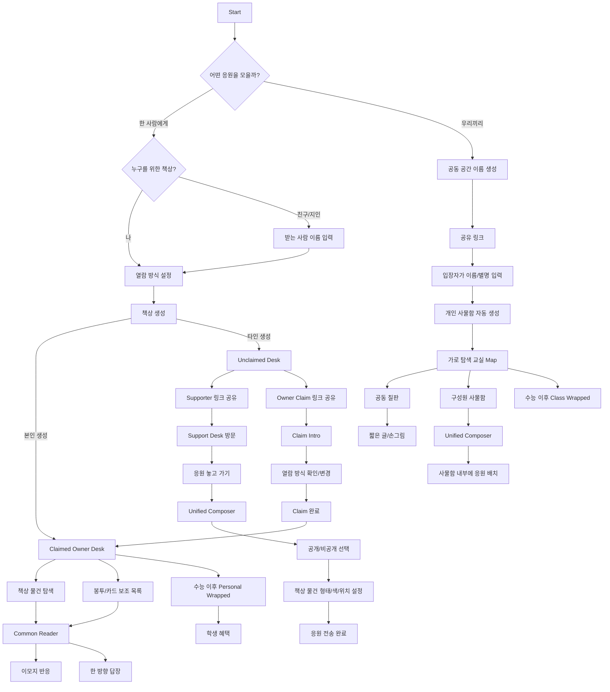

# 은_데모데이 — Team Product Guide

> 최종 정리 기준: 2026-10-03  
> 대상: 기획 · 디자인 · 프론트엔드 · 이후 백엔드/AI 구현 팀원  
> 목적: 이전 논의와 현재 코드 프로토타입 사이에서 **무엇이 확정된 제품 결정인지**, **현재 어디까지 구현되어 있는지**, **새 작업에서 무엇을 지켜야 하는지**를 한 곳에서 확인하기 위한 팀 공용 Source of Truth.

---

## 0. 문서 사용법

이 프로젝트는 Figma 탐색안, 채팅에서의 후속 결정, 코드 프로토타입이 빠르게 누적되면서 과거 안과 최신 결정이 일부 다릅니다.

충돌이 있을 때 우선순위는 다음과 같습니다.

1. 가장 최근에 명시적으로 확정한 제품/UX 결정
2. 이 문서 `docs/TEAM_PRODUCT_GUIDE.md`
3. `docs/PRODUCT_DECISIONS.md`
4. `docs/DESIGN_SYSTEM.md`와 `src/design-system` 실제 구현
5. 현재 활성 화면의 공통 패턴
6. 오래된 Figma 탐색안 / 과거 문구 / 임시 프로토타입

### 상태 표기

- **[확정]**: 팀이 새 기능을 만들 때 그대로 지켜야 하는 제품 결정
- **[현재 구현]**: 코드 프로토타입에 실제 반영된 상태
- **[계획]**: 제품 방향에는 포함되지만 실제 production 구현은 아직 아님
- **[미확정]**: 팀이 임의로 결정하면 안 되고 추후 확정이 필요한 항목

---

# 1. 서비스 한 문장 정의

**수험생이 수능 전까지 친구·가족·지인에게 받은 응원과 추억을 하나의 공간에 모아두고, 정해둔 순간에 열어보며, 수능 이후에는 그 기록을 다시 돌아볼 수 있게 하는 응원 아카이빙 서비스.**

핵심은 단순한 “응원 메시지 게시판”이 아니다.

서비스 경험은 다음 구조를 따른다.

```text
DROP → WAIT → OPEN → RESPOND → REMEMBER
응원을 남김 → 기다림 → 정해진 때 열람 → 가볍게 반응/답장 → 수능 후 기록으로 회고
```

---

# 2. 핵심 사용자와 가치

## 2.1 수험생 / 공간의 Owner

- 여러 사람의 응원을 하나의 자기 공간에 모은다.
- 실시간 피드처럼 계속 확인하기보다 자신이 정한 방식으로 응원을 기다렸다가 연다.
- 응원은 단순 텍스트 목록이 아니라 실제 책상 위 물건·봉투·카드처럼 축적된다.
- 읽은 뒤 이모지 반응 또는 한 방향 답장을 보낼 수 있다.
- 수능 이후에는 메시지 수, 추억, 사진, 반복 표현 등을 비경쟁적으로 돌아본다.

## 2.2 Supporter

- 로그인 없이도 링크를 통해 쉽게 들어와 응원을 남길 수 있어야 한다.
- “무슨 말을 써야 하지?”가 진입 장벽이 되지 않도록 소재·질문 도움을 받을 수 있다.
- 메시지는 직접 쓴 말과 사진, 꾸밈 요소를 활용해 개인적인 카드로 만든다.
- 공개/비공개 범위를 선택한다.
- 받은 답장이 있으면 “내가 남긴 이야기”의 맥락에서 확인한다.

## 2.3 Creator

수험생 본인이 아니라 친구가 먼저 그 사람의 응원 공간을 만들어줄 수 있다.

- Claim 전에는 Owner 링크, Supporter 링크, 초기 열람 방식 등을 관리할 수 있다.
- 수험생이 Claim하면 Creator의 관리 권한은 종료된다.
- Claim 이후 Creator는 다른 일반 Supporter와 같은 권한만 가진다.

## 2.4 Class / Group Member

개인 책상과 별도로 고3 반, 스터디, 친구 그룹 등 작은 공동체가 함께 쓰는 모드가 있다.

- 공동 칠판
- 구성원별 개인 사물함
- 서로의 사물함에 남기는 응원
- 수능 이후 집단 단위 Wrapped

---

# 3. 제품의 핵심 공간 모델

## 3.1 Personal Desk + Message Object

**[확정] 개인 모드의 홈은 카드 피드가 아니라 ‘나의 응원 책상’이다.**

응원 카드 원본과 책상에서의 표현은 분리한다.

```text
실제 응원 카드
→ 책상에서는 Memo / Letter / Photo Card / Poster / Charm / Ticket 등의 물건으로 표현
→ 물건을 누르면 실제 원본 카드 Reader가 열림
```

원칙:

- 책상에서 응원 물건이 핵심 foreground content다.
- 환경 장식이 메시지보다 먼저 눈에 들어오면 안 된다.
- 안 읽은 메시지는 책상에서 시각적으로 발견 가능해야 한다.
- 카드/봉투 목록은 **보조 탐색 수단**이며 홈을 대체하지 않는다.
- Owner의 카드/봉투 목록에서는 오늘 열 수 있는 메시지와 과거 메시지를 탐색할 수 있다.
- Incoming 봉투 목록은 Owner 경험이다. Supporter 화면을 Owner의 메시지 inbox처럼 만들지 않는다.

## 3.2 배치

**[확정] Supporter는 자신이 남긴 응원 물건의 위치를 책상 위에서 직접 조정할 수 있다.**

다만:

- 기존 응원을 완전히 가리는 배치는 허용하지 않는다.
- 새 물건의 초기 위치는 가능한 빈 공간을 우선한다.
- 물건 형태와 색조를 선택할 수 있다.
- 물건을 눌렀을 때 항상 원본 카드 읽기로 연결된다.

---

# 4. 서비스 진입 구조

현재 시작 화면은 사용자가 내부 제품 용어를 이해하도록 요구하지 않는다.

**[확정] 진입 선택은 사용자의 상황을 설명하는 문장으로 제공한다.**

현재 문구 구조:

1. **한 사람에게 마음을 모아줄래요**
   - 나 또는 한 친구를 위한 응원 책상
2. **우리끼리 서로 응원할래요**
   - 같은 공간의 공동 칠판 + 각자 사물함

“개인 모드 / 그룹 모드”, “Creator / Claim” 같은 내부 용어를 첫 화면에 그대로 노출하지 않는다.

수능 연도는 사용자가 입력하지 않는다. 서비스가 해당 연도의 수능 일정을 기준으로 동작한다.

현재 코드 기준 2027학년도 수능 시험일은 **2026-11-19**, Time Capsule 기본 공개 시점은 **수능 전날인 2026-11-18 20:00**이다.

---

# 5. 전체 서비스 플로우



---

# 6. 개인 책상 생성과 Claim

## 6.1 책상 생성

**[확정] 책상은 수험생 본인 또는 다른 Supporter가 만들 수 있다.**

### 본인이 생성

- 생성 즉시 claimed 상태
- 열람 방식을 직접 정함
- 완료 후 자신의 책상으로 이동
- Supporter에게 보낼 응원 링크 공유

### 다른 사람이 생성

- 받는 사람의 이름/닉네임 입력
- 처음에는 unclaimed 상태
- Creator가
  - 책상 주인에게 Claim 링크
  - 다른 사람들에게 Supporter 링크
  를 각각 공유할 수 있음
- Claim 전 Creator는 초기 설정을 관리할 수 있음

## 6.2 Claim

**[확정] Claim은 친구가 대신 만든 공간을 실제 수험생 계정/소유 경험으로 넘기는 handoff다.**

Claim 과정:

1. “친구들이 OO님을 위해 응원 책상을 만들었어요.”
2. 이미 모인 응원의 존재를 보여줌
3. **Claim 전에 도착한 응원 backlog를 별도로 안내**
4. 기존 열람 방식을 확인
5. 수험생이 Daily / Time Capsule을 그대로 쓰거나 변경
6. “내 책상으로 가져오기”
7. Owner 권한으로 전환

### Claim 전 backlog

**[확정] Claim 전에 쌓인 Daily 응원은 새 하루 batch로 다시 밀어 넣지 않고 ‘먼저 와 있던/지난 응원’으로 보관한다.**

첫 Claim에서:

- “친구들이 먼저 기다리고 있었어요.”
- 도착한 응원 수 / 마음을 남긴 친구 수 등으로 backlog 존재를 분명히 알림
- **“지금 만나보기” / “나중에 보기”** 선택 제공
- 나중에 보기를 선택해도 backlog는 사라지지 않음
- Owner Home에서 미확인 backlog가 있다는 안내를 계속 노출
- 사용자가 준비됐을 때 카드/봉투 Archive에서 열람 가능

Claim 이후:

- Creator의 관리 권한 종료
- Creator는 일반 Supporter가 됨
- 기존 응원은 그대로 유지
- Claim 이전에 쌓인 메시지는 “이미 친구들이 모아둔 응원”이라는 맥락이 분명해야 함

---

# 7. 응원 열람 방식

사용자에게는 내부 명칭보다 결과 중심 문구를 우선한다.

내부 타입:

- `daily`
- `time-capsule`

## 7.1 Daily — “하루를 마무리하며”

**[확정] 매일 정해진 시간에 그날의 응원을 batch로 연다.**

규칙:

- Owner가 매일 열람 시간을 설정
- 설정 시각 이전에 도착한 메시지 → 그날 설정 시각에 오픈
- 설정 시각 이후에 도착한 메시지 → 다음 날 설정 시각에 오픈
- 한 번 열린 메시지는 이후에도 계속 열람 가능
- 새 메시지의 locked/unlocked 상태는 별도 feed가 아니라 책상 object 상태에서 드러나는 것이 기본
- Daily batch에 대해 공통 답장을 보낼 수 있음

## 7.2 Time Capsule — “한 번에 열어보기”

**[확정] 설정된 날짜/시간까지 응원을 잠그고, 해당 시점에 함께 연다.**

- 기본값: 수능 전날 저녁
- 현재 코드 기본값: 2026-11-18 20:00
- 책상 생성자 또는 Claim한 Owner가 날짜/시간을 변경 가능
- 공개 시점 이후 기존 메시지는 계속 읽을 수 있음

---

# 8. Unified Composer

## 8.1 하나의 편집기

**[확정] ‘한 줄 / 사진 / 꾸미기 / 편지’ 같은 작성 모드를 먼저 고르게 하지 않는다.**

하나의 Composer에서 바로 글을 쓰고 필요한 요소만 추가한다.

도구:

- 배경
- 글자
- 문구(Word Art)
- 스티커
- 사진

## 8.2 AI / 아이디어 도움

현재 프로토타입은 deterministic prompt를 사용한다.

**[확정] 작성 도움은 완성된 응원문을 대신 써주는 기능이 아니라, 사용자가 자기 말을 떠올리게 하는 ‘소재와 질문’이어야 한다.**

예:

- 최근 같이 웃었던 일
- 같이 찍은 사진이나 추억
- 지금 상대가 하고 있을 것 같은 일
- 수능이 끝난 뒤 같이 하고 싶은 일
- 짧게라도 꼭 하고 싶은 말

선택한 질문은 writing prompt로만 남고, 본문에 자동 삽입하지 않는다.

**[계획] AI 활용 방향**

- 관계 / 추억 / D-day 맥락에 맞는 응원 소재·질문 제안
- 사용자가 원하는 분위기의 카드 이미지·디자인 제작 보조
- 수능 후 여러 응원을 주제·감정·반복 표현 등으로 재구성

AI가 사용자의 진짜 메시지 목소리를 대체하지 않는 것이 원칙이다.

## 8.3 사진

**[확정] 사진 입력은 카메라 촬영과 기존 앨범 선택을 모두 지원하는 방향이다.**

카드에서 사진은:

- plain
- white frame
- polaroid

등의 표현이 가능하며 위치·크기·회전을 조정할 수 있다.

## 8.4 텍스트 / Word Art

- 일반 직접 입력 문구는 읽기 좋은 정돈된 손글씨 계열을 사용할 수 있음
- 강한 한마디는 별도 Word Art asset으로 분리
- 현재 Word Art:
  - 네가
  - 성공하는
  - 이유
  - 잘 될 거야
- Word Art는 raster 이미지가 아니라 **코드/SVG asset**으로 관리
- 텍스트 박스는 복수 개 생성 가능
- 텍스트 목록/칩을 눌러 해당 텍스트 박스를 선택 가능
- 직접 조작과 pinch 기반 크기 조정 방향을 유지

---

# 9. 카드 페이지 규칙

**[확정] ‘Long Card’ 대신 표준 카드 여러 장을 이어 쓰는 구조를 사용한다.**

- 모든 카드는 표준 **4:5**
- 한 메시지는 **최대 3장**
- 카드 추가 버튼은 항상 찾을 수 있어야 함
- 텍스트가 안전 영역을 넘친 뒤에만 카드 추가를 제안하는 구조로 제한하지 않음
- 텍스트를 자동으로 다음 카드로 쪼개지 않음
- 현재 MVP에서 카드 순서 재정렬은 필수 아님

새 카드 추가 시 상속:

- 현재 카드의 배경
- 마지막 텍스트 요소의 스타일

상속하지 않음:

- 실제 텍스트 내용
- 스티커
- Word Art
- 사진

각 카드 페이지는 자체적으로 다음을 저장한다.

- background
- text elements
- word art elements
- sticker elements
- photo elements

## 9.1 Renderer parity

**매우 중요**

> Composer에서 만든 결과와 Recipient Reader에서 보이는 결과가 달라지면 안 된다.

Editor / Reader가 공유해야 하는 것:

- card geometry
- background rendering
- text position / width
- sticker / Word Art geometry
- photo frame
- rotation / scale
- z-index

새 카드 요소를 추가할 때 Editor와 Reader를 따로 구현하지 말고 shared renderer 계층을 먼저 확장한다.

---

# 10. 메시지 공개 범위

메시지는 `public` 또는 `private`.

## Public

- Owner 외 방문자가 공개 응원을 볼 수 있는 설정과 연결
- 방문자는 공개 응원에 가벼운 reaction 가능
- 숨기기 / 신고 / 해당 Supporter 숨기기 가능

## Private

- Owner만 원본 내용을 열 수 있음
- Group locker에서도 private message는 사물함 주인만 열 수 있음
- Class Wrapped 분석/공유 데이터에서 private locker content는 제외

## 전송 후 수정/삭제

**[확정]**

- Public → Private 전환은 전송 후 지원하지 않음
- Supporter는 자신이 보낸 **공개 응원**을 Owner가 읽기 전까지만 삭제 가능
- Owner가 읽은 뒤에는 삭제 불가

---

# 11. Reader, Reaction, Reply

## 11.1 공통 Reader

다음 경로들은 같은 카드 renderer/reader 규칙을 재사용한다.

- Personal Desk Object → Reader
- Owner Envelope/Card list → Reader
- Classroom Locker Object → Reader

## 11.2 Reaction

응원을 읽은 뒤 가벼운 emoji reaction 가능.

현재 모델:

- heart
- teary
- clap

## 11.3 Reply

**[확정] 답장은 채팅이 아니다.**

- Owner → 특정 응원에 한 방향 답장
- Daily mode에서는 그날 열린 batch의 고유 Supporter들에게 하나의 공통 답장 가능
- 같은 Supporter가 batch에 여러 메시지를 보냈어도 공통 답장은 한 번만 전달
- 답장에 다시 답장하는 nested thread 없음
- Supporter 화면에서는
  - “내가 남긴 이야기”
  - “OO님의 답장”
  구조로 확인
- 답장 화면에서의 다음 행동은 “답장에 재답장”이 아니라 **새로운 응원 남기기**

---

# 12. Owner / Creator 관리

## 12.1 Owner가 관리할 수 있는 것

- Daily / Time Capsule 일정
- 공개 응원을 방문자가 볼 수 있는지
- 새 응원 알림
- Supporter 초대 링크
- 숨김 / 차단한 Supporter
- 별도로 만들어진 다른 방을 코드로 연결
- 새 응원 받기 종료
  - 기존 메시지는 계속 읽을 수 있음

## 12.2 다중 공간

**[확정] 이름이 같다는 이유 등으로 방을 자동 병합하지 않는다.**

다른 방을 연결하더라도:

- 방 자체는 별개로 유지
- 메시지도 합쳐지지 않음
- 연결은 관리 편의 기능이지 데이터 merge가 아님

---

# 13. Class / Group mode

## 13.1 대상

고3 반, 스터디, 친구 그룹 등 수능을 함께 준비하는 작은 공동체.

**[확정] 생성자/구성원 역할을 생성 단계에서 복잡하게 나누지 않는다.**

- 공간 생성 시 구성원 이름을 미리 받지 않음
- 링크를 받은 사람이 입장 후 자기 이름/별명을 입력
- 입력한 이름으로 사물함 1개 자동 생성
- 사물함 Claim 과정 없음

## 13.2 Classroom Map

**[확정] 기능 메뉴 목록이 아니라 좌우로 탐색하는 2D 교실 장면이 메인 경험이다.**

사용자는:

- 왼쪽/오른쪽으로 교실을 둘러봄
- 칠판 자체를 눌러 칠판 경험으로 이동
- 사물함 자체를 눌러 해당 사물함 경험으로 이동

## 13.3 Blackboard

- 공동 / 공개 성격
- 작성 즉시 볼 수 있음
- 짧은 텍스트
- 자유로운 손그림 / chalk drawing 지원

## 13.4 Locker

- 구성원당 하나
- 사물함 응원은 기존 Unified Composer 재사용
- 최대 3장 카드 규칙 동일
- 배치 목적지만 책상이 아니라 사물함 내부
- public 응원은 다른 방문자가 볼 수 있음
- private 응원은 사물함 주인만 열 수 있음
- 사물함 주인의 응원 열람 방식은 **Daily only**

## 13.5 Locker visual rule

최근 논의에서 특히 중요하게 정한 구현 기준:

- 사물함 문 앞면과 뒷면은 같은 면을 뒤집어 쓰면 안 됨
- 문이 열리면 실제로 **문의 안쪽/뒷면**이 보여야 함
- 경첩 축을 기준으로 한 회전, 문 두께, 내부 깊이감이 자연스러워야 함
- 열린 문이 사라지거나 clipping되어서는 안 됨
- 내부 공간도 평면 카드처럼 보이지 않도록 depth를 가져야 함
- 저품질 작은 사용자 캐릭터는 넣지 않는 편이 낫다고 결정 → 현재 제거

현재 Locker scene은 여러 차례 재구축되었으나, 시각 완성도는 이후 추가 QA 대상이다. 기능 플로우 진행을 막는 blocker로 취급하지 않는다.

---

# 14. 수능 이후 경험

## 14.1 Personal Wrapped

**[확정] Wrapped는 경쟁 서비스가 아니다.**

다룰 수 있는 것:

- 받은 응원의 전체 기록
- 참여한 친구/Supporter
- 사진
- 참여 일수
- 자주 등장한 주제
- 감정
- 반복 표현
- 대표 문장
- 공개 동의한 Supporter nickname reveal

공유 이미지:

- 집계/요약 통계를 활용
- 원본 메시지 본문을 그대로 노출하지 않음

금지:

- 메시지 많이 받은 사람 순위
- 친구 수 순위
- 응원량으로 사람을 평가하는 구조

## 14.2 Class Wrapped

개인 성과가 아니라 **그룹의 기록**을 요약.

가능:

- 전체 응원량
- 칠판 활동
- public content에서 자주 나온 단어/emoji
- 공유 가능한 aggregate card

금지:

- 누가 가장 많은 응원을 받았는지 순위화
- 특정 구성원을 비교/평가
- private locker message를 분석·공유 데이터에 포함

## 14.3 Benefits

Wrapped 이후 수험생 혜택으로 이어질 수 있다.

현재 prototype:

- 카테고리 기반 혜택 목록
- 혜택 상세
- 파트너 / 기간 / 조건
- 쿠폰 저장
- 현장 제시
- 사용 완료

### 사업 방향

핵심 서비스가 먼저 수험생에게 자발적으로 쓰이는 제품이 된 뒤,
수험생 대상 홍보를 원하는 매장/브랜드와 연결해 수험생에게 실제 할인·혜택을 제공하는 방향을 고려한다.

이 사업모델은 핵심 응원 경험보다 앞에 나오면 안 된다.

---

# 15. 로그인 / 계정

## 15.1 기본 원칙

**[확정] 로그인하지 않았다고 해서 서비스 핵심 경험을 막지 않는다.**

비로그인에서도 최소한:

- 공간 진입/탐색
- 응원 작성
- 공간 생성

이 가능한 방향을 유지한다.

계정은 다음 가치를 위해 존재한다.

- 재방문
- 내가 만든/소유한 공간을 다시 찾기
- 설정 유지
- 소유권/Claim
- 알림 및 장기 데이터 유지

## 15.2 로그인 방식

MVP 방향:

- 자체 이메일 회원가입 / 로그인
- Google 간편 로그인 우선
- Kakao는 공수가 남을 경우 후속
- 비밀번호 재설정
- 로그아웃
- 회원 탈퇴 플로우

현재 코드의 인증은 **mock state**이며 실제 credential, OAuth session, 서버 인증은 구현되어 있지 않다.

---

# 16. 디자인 원칙

가장 중요한 문장:

> **UI는 깨끗하게, 콘텐츠는 살아있게.**

## 16.1 Service UI

- 차분함
- 절제됨
- premium
- 정보 위계가 분명함
- 기능 없는 장식성 English label을 반복해서 넣지 않음

UI 기본 font:

- Pretendard

색:

- Ink 계열: 구조적/기능적 primary action
- Coral: “응원 놓고 가기”, “책상 만들기”, “내 책상으로 가져오기”처럼 감정적으로 중요한 순간에 제한적으로 사용

## 16.2 User-created content

서비스 shell과 달리 자유로워도 된다.

- 손글씨
- 밈
- 스티커
- 사진
- 컬러
- 거친 Word Art
- 개인적 취향

**서비스 UI 디자인시스템과 사용자 카드 스타일 시스템은 섞지 않는다.**

## 16.3 2.5D asset direction

Desk / object / decorative assets:

- 너무 flat한 icon보다는 살짝 3D
- 물성이 느껴지는 질감
- 따뜻한 2.5D
- 약간 위에서 내려다보는 시점
- message object를 가리지 않는 환경

---

# 17. 프론트엔드 구현 원칙

새 작업에서 반드시 지킬 것:

1. 공통 UI는 `@/design-system`을 먼저 사용
2. color는 semantic token 우선
3. spacing은 `--space-*` 우선
4. radius는 공통 token 우선
5. 카드 asset은 component 내부 하드코딩 대신 registry에 등록
6. Editor / Reader rendering은 shared rule 유지
7. safe-area 고려
8. reduced-motion 고려
9. 버튼/아이콘 접근성 label 유지
10. 동일한 UI를 feature마다 다시 만들지 않음
11. 사용자 카드의 장식 색을 service semantic color token으로 섞지 않음
12. 설명 문구를 control 주변에 중복해서 과도하게 배치하지 않음

---

# 18. 현재 GitHub 구현 상태

Repository:

`EunseongOH/eun_demoday_prototype`

기본 브랜치는 `main`이지만, **현재 실제 구현은 feature branch에 누적되어 있다.**

2026-10-03 기능 구현 스냅샷 기준:

| Branch | main 대비 | 의미 |
| --- | ---: | --- |
| `main` | baseline | 초기 커밋 수준 |
| `feat/phase1-foundation` | +12 commits | React/Vite/TS, design system foundation, prototype skeleton |
| `feat/phase2-supporter-core` | +59 commits | Composer, supporter flow, desk scene, envelope/reader |
| `feat/recipient-multicard-viewer` | +211 feature commits + 이후 문서화 commits | 현재 가장 많은 기능이 누적된 브랜치 |

최신 기능 구현 상태에서 `feat/recipient-multicard-viewer`는 main에서 크게 앞선 누적 작업 브랜치이며, 이후 문서화 commit까지 포함하면 이 문서 갱신 직전 **main 대비 214 commits ahead / 164 files changed** 상태였다.

최신 기능 구현 기준 commit:

- `48b5d59` — `feat: add pre-claim encouragement backlog flow`
- 2026-10-03 14:04 KST

바로 이전 주요 기능 commit:

- `efa5d95` — `feat: implement supporter settings flow`
- 2026-10-03 14:01 KST

`TEAM_PRODUCT_GUIDE.md` 추가, README 갱신, 이후 guide 보정 commit은 문서화 변경이며 제품 기능 변경이 아니다.

최근 주요 구현:

- Claim 전 응원 backlog: 지금 만나보기 / 나중에 보기 / Owner Home 재진입
- Supporter settings
- 읽기 전 보낸 공개 응원 삭제
- Password reset prototype
- Class Wrapped
- One-way reply + public reaction
- Composer idea prompts
- Personal Wrapped + benefits
- Owner / Creator management
- Account lifecycle
- Classroom/group experience
- Locker scene rebuild
- Daily batch unlock
- Time Capsule unlock
- Claim handoff
- Personal desk creation
- 3-page card model
- Composer/Reader shared geometry
- sticker / photo / Word Art / multi-text editing

현재 latest commit에는 Vercel success status가 확인된다.

---

# 19. 현재 route 기준 구현된 화면군

## Entry / Account

- `/start`
- `/auth/login`
- `/auth/signup`
- `/auth/reset-password`
- `/account`
- `/account/delete`

## Personal Desk Creation

- `/prototype/create`
- `/prototype/create/recipient`
- `/prototype/create/read-mode`
- `/prototype/create/complete`

## Supporter

- Support Desk
- Unified Composer
- Placement
- Complete
- Sent messages
- Replies
- Supporter settings

## Owner

- My Desk
- Card/Envelope list
- Reader
- Reply
- Desk settings
- Blocked supporters
- Connect rooms
- End intake

## Claim

- Claim intro
- Pre-claim backlog
- Read mode review
- Claim complete

## Class / Group

- Create
- Join
- Classroom Map
- Blackboard
- Locker
- Locker Composer
- Locker Placement
- Class Wrapped

## Post-exam

- Personal Wrapped
- Benefits list/detail/coupon

## Internal

- `/prototype`: prototype index
- `/system`: live design-system gallery

---

# 20. 현재 prototype과 production의 경계

현재 저장소의 목적은 **interactive UX specification**이다.

즉 “어떤 화면과 상태 전이가 필요한지”는 상당히 구현되어 있지만 production backend가 있는 서비스는 아니다.

현재 production 전환 시 별도 구현이 필요한 대표 항목:

- 실제 DB persistence
- 실제 image storage
- real authentication / OAuth
- Claim token 및 ownership 검증
- 실제 room/share URL routing
- notification infrastructure
- upload/storage lifecycle
- abuse/report backend
- analytics
- production AI integration
- responsive desktop layout 상세
- 전체 accessibility QA

현재 Zustand persisted browser state는 production 데이터 계약으로 간주하지 않는다.

---

# 21. 팀이 임의로 바꾸면 안 되는 결정

아래는 다시 논의 없이 과거 안으로 되돌리면 안 된다.

- 개인 홈을 카드 feed로 변경
- Composer 진입 전에 작성 타입을 먼저 고르게 하기
- 카드를 Long Card 하나로 늘리기
- 카드 추가를 overflow 발생 후에만 허용
- 메시지 텍스트를 자동으로 다음 페이지로 분할
- 최대 3장 규칙을 임의로 변경
- Editor와 Reader를 별도 renderer로 구현
- Claim 후 Creator에게 별도 관리 권한 유지
- 동일 이름의 방을 자동 merge
- Reply를 채팅 thread로 확장
- Wrapped에 경쟁/랭킹 요소 추가
- Class 생성 시 모든 구성원 이름을 미리 입력시키기
- Class locker에 Claim 절차 추가
- Blackboard를 Daily lock으로 변경
- Locker owner의 읽기 모드를 Time Capsule까지 확장
- private locker content를 Class Wrapped에 사용
- 저품질 아바타를 억지로 추가
- locker door의 앞/뒤를 같은 flat face로 처리
- service UI와 user-generated card style을 하나의 palette/component system으로 섞기

---

# 22. 아직 확정되지 않았거나 production에서 결정할 것

팀원이 독단적으로 확정하지 말고 별도 논의할 항목:

- 실제 서비스명 / 브랜드명
- production에서 로그인 강제를 거는 정확한 순간
- Kakao login 포함 여부
- 실제 backend stack 최종 선택
- AI 카드 디자인 생성의 구체 모델/API/비용/안전 정책
- desktop/tablet breakpoint와 상세 layout
- 실제 partner/benefit 운영 정책과 수익 모델
- notification 채널 및 빈도
- abuse/report 운영 프로세스
- locker scene의 최종 visual polish 수준

---

# 23. 현재 문서에서 바로잡아야 할 충돌

## README

현재 feature branch의 `README.md`가 아직 “Phase 1 foundation is implemented” 중심으로 적혀 있어 실제 구현 수준보다 오래된 상태다.

→ 이 문서를 최신 전체 현황의 기준으로 사용한다.

## DESIGN_SYSTEM.md

현재 문서 하단에 다음 두 내용이 동시에 있다.

- Card model: 4:5 standard cards, maximum 3 pages per message
- multi-page card: removed from the product model

두 번째 문장은 최신 제품 결정 및 실제 코드와 충돌한다.

**최신 확정:**  
“Long Card 모델을 제거하고, 한 메시지 안에서 최대 3개의 표준 4:5 카드 페이지를 사용한다.”

---

# 24. 새 작업 시작 전 체크리스트

새 기능/수정 PR을 시작하기 전에 확인한다.

- [ ] 이 기능은 Personal / Supporter / Owner / Creator / Class 중 누구의 경험인가?
- [ ] Claim 전/후 권한 차이를 침범하지 않는가?
- [ ] Daily / Time Capsule의 lock rule을 깨지 않는가?
- [ ] Public / Private 경계를 침범하지 않는가?
- [ ] Desk가 여전히 핵심 home experience인가?
- [ ] 카드 작성 결과가 Reader에서 동일하게 보이는가?
- [ ] 최대 3장 / 4:5 규칙을 유지하는가?
- [ ] 새 asset을 registry에 추가했는가?
- [ ] 기존 design token/component로 해결 가능한 UI를 재작성하지 않았는가?
- [ ] Class Wrapped에 private 데이터나 랭킹이 섞이지 않는가?
- [ ] 과거 Figma보다 최신 제품 결정이 우선되었는가?
- [ ] prototype-only 구현을 production 계약처럼 굳히고 있지 않은가?

---

# 25. 관련 문서 / 코드

제품:

- `docs/PRODUCT_DECISIONS.md`
- `src/app/router.tsx`
- `src/types/desk.ts`
- `src/types/message.ts`
- `src/types/classroom.ts`
- `src/types/user.ts`

디자인:

- `docs/DESIGN_SYSTEM.md`
- `src/design-system/`
- `/system`

Composer / Card:

- `src/features/composer/`
- `src/features/composer/cardRenderShared.css`
- `src/features/composer/cardRenderStyles.ts`

Desk / Read mode:

- `src/features/desk/`
- `src/features/owner/`
- `src/features/deskCreation/`
- `src/features/claim/`

Class:

- `src/features/classroom/`

Post-exam:

- `src/features/wrapped/`

---

## 마지막 기준

이 서비스에서 중요한 것은 “많은 기능”이 아니라 **응원이 쌓이고, 기다려지고, 자기만의 순간에 열리고, 다시 추억으로 남는 경험이 하나의 세계관 안에서 일관되게 이어지는 것**이다.

기능을 새로 추가할 때는 항상 다음 질문을 먼저 본다.

> 이 기능이 응원을 더 진짜 사람의 마음처럼 느끼게 하는가, 아니면 단순히 화면과 기능 수만 늘리는가?
